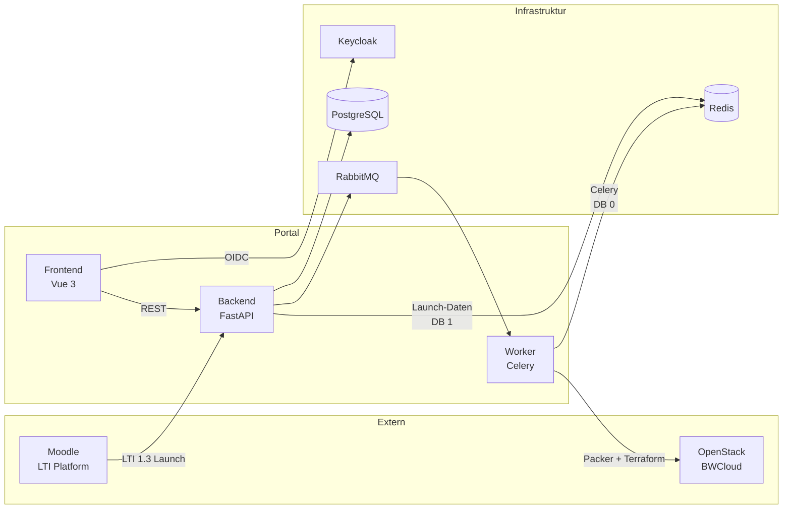
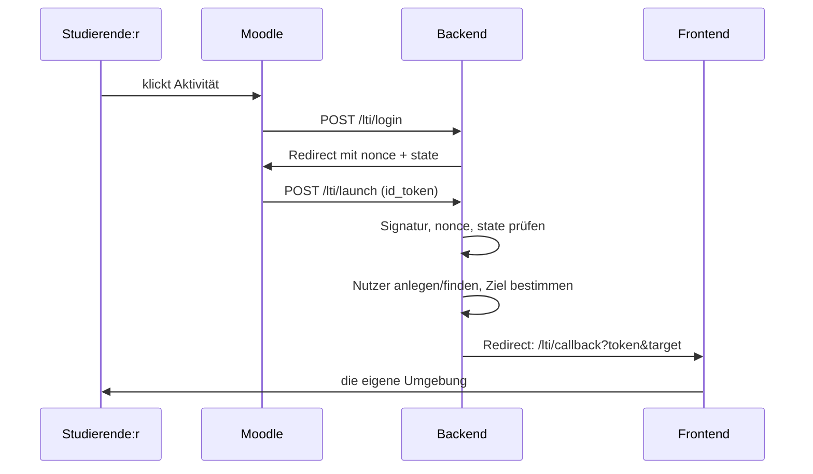

# Architektur: Self-Service-Portal und Moodle/LTI-Anbindung

Stand: 18.09.2026

Der App Store hat einen zweiten Weg hinein bekommen. Bisher meldeten sich
alle direkt über Keycloak an; jetzt kommen Studierende aus Moodle, ohne zu
wissen, dass es einen App Store gibt. Das ändert drei Dinge an der
Architektur: eine zweite Sitzungsart, zwei neue Tabellen und eine
rollenabhängige Ansicht.

## Bausteine

Neu gegenüber dem letzten Stand ist allein die Kante **Moodle → Backend**.
Worker, OpenStack-Pfad und Frontend-REST bleiben unverändert — die
LTI-Anbindung hängt sich an die Authentifizierung, nicht an die Fachlogik.

## Zwei Wege hinein

| | Direkter Login | Launch aus Moodle |
|---|---|---|
| Wer | Lehrende, Admins, Studierende am Rechner | Studierende, die in Moodle auf die Aktivität klicken |
| Identität | Keycloak (OIDC) | Moodle signiert ein `id_token` (LTI 1.3) |
| Sitzung | Keycloak-Token mit stiller Erneuerung | eigenes Token des Backends, 120 Minuten, ohne Erneuerung |
| Einstiegspunkt | `/login` | `/lti/callback` |

**Warum eine eigene Sitzung statt Keycloak?** Aus Moodle heraus ist der App
Store ein Drittanbieter-Frame. Keycloaks stille Token-Erneuerung läuft über
ein verstecktes iframe, und Browser blockieren dort die Cookies — der Nutzer
flöge mitten in der Sitzung raus. Deshalb stellt das Backend nach dem Launch
ein eigenes, kurzlebiges Token aus. Läuft es ab, klickt man in Moodle erneut;
das kostet einen Klick und prüft nebenbei die Kursmitgliedschaft neu.

Beide Wege münden in **eine** Authentifizierungs-Abhängigkeit
(`app/utils/auth.py`), die anhand des `iss`-Claims entscheidet, welcher
Prüfer läuft. Für jeden Endpunkt dahinter ist der Unterschied unsichtbar.

## Der Launch

Der Umweg ist Absicht: das Tool muss den Austausch anfangen, damit es die
`nonce` vergibt, die im Token zurückkommen muss. Ohne sie ließe sich ein
abgefangenes Token einfach wiederholen.

`target` ist neu. Das Backend rechnet **vor** dem Redirect aus, wo dieser
Launch landen soll, statt alle auf ein Dashboard zu schicken. Das Frontend
nimmt nur In-App-Pfade an; alles andere fällt auf das Dashboard zurück, damit
ein manipulierter Launch-Link keine Weiterleitung nach außen erzeugen kann.

## Datenmodell: zwei Tabellen dazu

| Tabelle | Zweck |
|---|---|
| `user_identities` | Ein lokales Konto kann mehrere Identitäten haben. Schlüssel ist `(provider, issuer, subject)` — die Moodle-Nutzer-ID, nicht die E-Mail-Adresse. |
| `lti_contexts` | Merkt sich den Moodle-Kurs, aus dem ein Launch kam, und die Studiengruppe, der er zugeordnet wurde. |

Zwei Entwurfsentscheidungen stecken darin:

**Die E-Mail-Adresse identifiziert niemanden.** Sie ist ein bearbeitbares
Moodle-Profilfeld. Trifft ein unbekannter Launch auf eine Adresse, die schon
einem Konto gehört, wird er abgelehnt und der Mensch muss sich einmal direkt
anmelden — erst diese beiden Hälften zusammen verknüpfen die Identität.

**Ein Moodle-Kurs ist keine Studiengruppe.** `lti_contexts.courseId` bleibt
leer, bis jemand, der den Kurs unterrichtet, die Zuordnung setzt. Raten würde
Leute an die falsche Gruppe hängen. Die Zuordnung ist ein **Wegweiser, keine
Berechtigung**: sie wählt unter den Umgebungen aus, in denen jemand ohnehin
Mitglied ist, und fügt keine hinzu.

## Rollen und Sichten

Drei Schichten, bewusst getrennt:

| Schicht | Wo | Frage |
|---|---|---|
| Rolle | `app/utils/permissions.py` | Darf diese *Art* Mensch das überhaupt? |
| Capability | `app/utils/capabilities.py` | Darf *dieser* Mensch *dieses* Objekt? |
| Ansicht | `src/router/index.ts`, `useRole` | Was zeige ich, damit niemand ins Leere klickt? |

**Das Frontend versteckt nur, das Backend verbietet.** Die Router-Guards und
ausgeblendeten Knöpfe sind Bequemlichkeit; jede Entscheidung fällt noch einmal
serverseitig.

Daraus folgt die Rollenteilung im Self-Service-Portal: **Lehrende richten
Umgebungen ein, Studierende bekommen Zugang.** Eine Studierende kann kein
Deployment anlegen — der Endpunkt lehnt es mit `role_required` ab —, sieht
dieselbe Liste unter dem Namen „Meine Umgebungen", und erhält über
`/deployments/{id}/my-access` ausschließlich ihre **eigenen** Zugangsdaten;
die der Teamkolleg:innen stecken in denselben Terraform-Outputs und werden
serverseitig herausgefiltert.

Eine Trainerrolle in Moodle macht dabei niemanden zum Lehrenden im App Store.
Die Rolle regelt den Zugriff auf fremde OpenStack-Ressourcen; wer in irgendeinem
Moodle-Kurs Trainer ist, darf darüber nicht entscheiden. Der Schalter dafür
(`LTI_TRUST_INSTRUCTOR_ROLE`) steht auf `false`.

## Was bewusst gleich geblieben ist

- **Der Deployment-Pfad.** Packer → Terraform → OpenStack, unverändert. Ein
  aus Moodle gestarteter Nutzer durchläuft dieselbe Kette wie jeder andere.
- **Ein Satz Endpunkte.** Es gibt keine „LTI-Variante" der Fach-API. Der
  Unterschied endet bei der Authentifizierung.
- **Eine Ansicht pro Seite.** Keine zweite Oberfläche für Studierende, sondern
  dieselbe Seite mit zwei Datenquellen — sonst driften beide auseinander und
  jede Korrektur fällt doppelt an.

## Betrieb

Moodle läuft im Dev-Stack als eigenes Compose-Projekt, getrennt vom App Store
(eigenes Netz, eigene Datenbank). Aufbau und Registrierung stehen in
[`moodle-lti-dev.md`](moodle-lti-dev.md).

Die LTI-Launch-Daten liegen in **Redis DB 1**, Celery benutzt **DB 0** — sonst
räumt ein Broker-Flush die laufenden Launches mit weg.

`LTI_ENABLED` ist der Kill-Schalter. Steht er auf `false`, antworten alle
`/lti`-Endpunkte mit 503, und der direkte Login bleibt davon unberührt.
